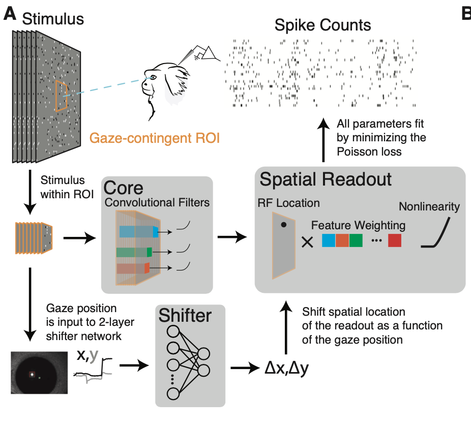
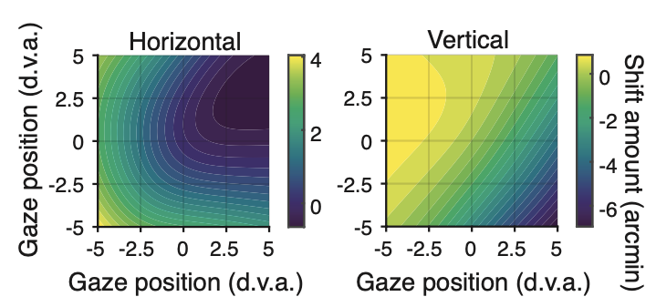
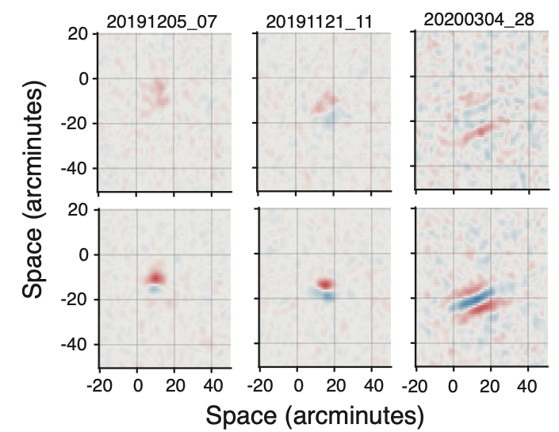

# Free viewing methods
This repo contains examples from Yates et al., 2021. There are two example figures to be found (as jupyter notebooks or interactive python scripts). 
1. [V1: Example Spike-based Eye Calibration](examples/example_2D_eye_calibration.ipynb)
2. [MT: Free Viewing GLM](examples/example_MT.py)

## Overview
This repo contains the model code and examples to fit calibration matrices / shifters for correcting the eye-calibration using spikes from V1. An explanation of the model architecture can be found here with more background [here](https://jake.vision/blog/lurz-paper). 


The model is fit end-to-end from stimulus to spikes by minimizing the poisson loss. The parameters of the neural network and readout are really not the focus of this model. The goal is to get calibration matrices, such as these:


These say how much to shift the eye position as a function of where the Marmoset is looking on the screen. The x and y axis are in degrees of visual angle and the colorbar is in arcminutes.

The result of this kind of correction makes a big difference in the measured receptive fields for the population of neurons recorded. Below, you'll find the spatial receptive fields for three example neurons.



## Getting started

### 1. Setting up the environment
The environment requirements are provided both as a `requirement.txt` file and as a conda `environment.yml` file. Your choice.
``` shell
$ pip install -r requirements.txt
```
or
```
conda env create -f environment.yml

conda activate NDN
```

### 2. Getting the example datasets
To run the code you will need datasets from [this repo](https://github.com/jcbyts/datasets). A few of the sessions have been packaged as a pytorch dataset and will download automatically. There are two dataset types (`PixelDataset` and `MTDotsDataset`). They will download their files if they don't already exist on your harddrive. However, the `PixelDataset` is 70x70x240Hz movies and is therefore quite big for a single session (2-3GB) so make sure you have enough space.

### 3. Example notebooks
Examples can be found here:
1. [V1: Example Spike-based Eye Calibration](examples/example_2D_eye_calibration.ipynb)
2. [MT: Free Viewing GLM](examples/example_MT.py)


